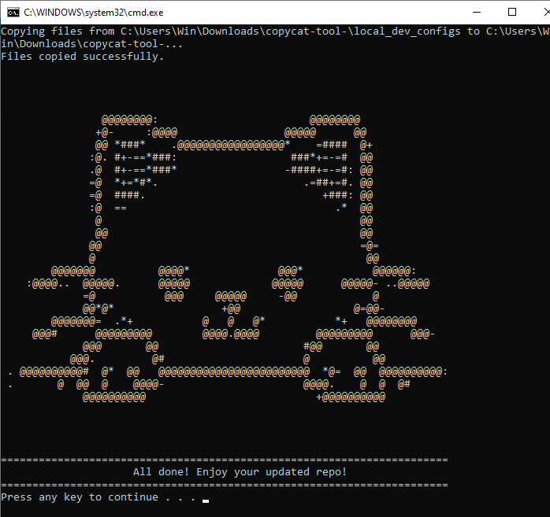
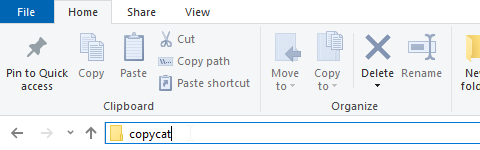

# Copycat-CLI-Tool-

This Windows batch script copies all files and folders from a pre-defined `files-to-copy` directory (located beside the script) into the **current working directory** — wherever the script is executed.



## 📄 Script Overview

**Filename:** `copycat.bat`
**Purpose:** Copy all files from the script’s `files-to-copy` directory into your current directory, overwriting existing ones if needed.

---

## ⚙️ How It Works

1. Determines the folder where the script itself is located (`%~dp0`).
2. Uses `xcopy` to recursively copy everything inside `files-to-copy` into your **current working directory (`%CD%`)**.
3. Silently overwrites existing files without confirmation.
4. Displays success or error messages.

---

## 📁 Folder Structure Example

```
/your-tools-folder
│
├── files-to-copy/
│   └── kittens.jpeg
│
└── copycat.bat
```

> ⚠️ The folder **`files-to-copy` must be in the same directory** as `copycat.bat`.

---

## 🚀 How to Use

### 🖥️ Option 1 — Run Directly

From the Command Prompt or PowerShell:

```cmd
C:\path\to\copycat.bat
```

This will copy everything from `files-to-copy` into **your current working directory** (the one from which you executed the script).

---

### ⚙️ Option 2 — Add to PATH (Run from Anywhere)

To make the script accessible system-wide:

1. Move the script folder (e.g., `C:\Tools\copy-script\`) to a permanent location.
2. Open **System Properties → Advanced → Environment Variables**.
3. Edit the **Path** variable (under *System Variables*).
4. Add the full path to your script’s folder.
5. Restart your terminal.

Now you can run it from anywhere simply by typing:

```cmd
copycat
```

or

```cmd
cc
```

#### 💡 Tip — Run from File Explorer Adddress Bar

After adding the script folder to your system PATH, you can also execute it **directly from the Windows Explorer search bar**:

1. Open any folder in **File Explorer**.

2. In the address bar at the top, type `copycat` or `cc`
3. Press **Enter**.

4. The script will execute in that folder — copying files into it automatically.

This works exactly like running it from Command Prompt or PowerShell.


---

## 🧠 Notes

* Uses `xcopy` with flags:

  * `/s` — Copies directories and subdirectories (except empty ones).
  * `/y` — Suppresses overwrite confirmation prompts.
  * `/q` — Runs quietly (no file listing).
* `%~dp0` — Expands to the path of the script itself.
* `%CD%` — Expands to the path of the directory where the command was executed.
* The script pauses at the end to allow you to read the output.
